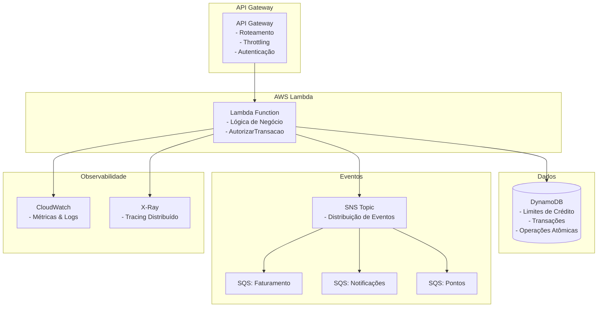

# Sistema de Autorização de Transações

## 🏗️ Arquitetura Serverless e Orientada a Eventos

Este projeto implementa uma **API de alta disponibilidade** para autorização de transações financeiras, seguindo os princípios de **System Design** modernos com foco em **observabilidade**, **resiliência** e **escalabilidade**.

## 📋 Índice

1. [Visão Geral da Arquitetura](#visão-geral-da-arquitetura)
2. [Componentes Principais](#componentes-principais)
3. [Conceitos Implementados](#conceitos-implementados)
4. [Estrutura do Projeto](#estrutura-do-projeto)
5. [Observabilidade: Os 3 Pilares](#observabilidade-os-3-pilares)
6. [Funcionamento da API](#funcionamento-da-api)
7. [Trade-offs e Decisões de Design](#trade-offs-e-decisões-de-design)
8. [Como Executar](#como-executar)

---

## 🎯 Visão Geral da Arquitetura

### Problema Original
Implementar o endpoint `POST /transacoes` que deve:
- ✅ **Alta Disponibilidade** e **Baixa Latência** (<100ms)
- ✅ **Segurança** e **Validação** robusta
- ✅ **Notificação assíncrona** para sistemas downstream
- ✅ **Observabilidade** completa

### Solução Arquitetural



---

## 🔧 Componentes Principais

### 1. **API Gateway** (Porta de Entrada)
- **Função**: Recebe requisições HTTP do mundo exterior
- **Responsabilidades**:
  - Roteamento de requisições
  - Throttling (proteção contra abuso)
  - Autenticação JWT
  - CORS e validação de entrada

### 2. **AWS Lambda** (Lógica de Negócio)
- **Função**: Executa a lógica de autorização de transações
- **Vantagens**:
  - Escalabilidade automática (0 → milhares de req/s)
  - Pagamento por execução
  - Gerenciamento de infraestrutura pela AWS

### 3. **DynamoDB** (Armazenamento)
- **Função**: Armazena limites de crédito e transações
- **Escolha Justificada**:
  - Latência de milissegundos em qualquer escala
  - Operações atômicas (evita race conditions)
  - Chave de partição: `cliente_id`

### 4. **SNS + SQS** (Eventos Assíncronos)
- **Função**: Desacoplamento pós-transação
- **Padrão**: Pub/Sub com múltiplos consumidores
- **Vantagem**: Resiliência (falha em um sistema não afeta outros)

---

## 💡 Conceitos Implementados

### 1. **Clean Architecture & Hexagonal Architecture**
```
📁 internal/
├── 📁 core/
│   ├── 📁 domain/          # Entidades e regras de negócio
│   └── 📁 service/         # Casos de uso
├── 📁 repository/          # Adaptadores para dados
├── 📁 handler/             # Adaptadores para entrada
└── 📁 observability/       # Cross-cutting concerns
```

### 2. **Domain-Driven Design (DDD)**
- **Entidades**: `Transacao`, `Cliente`, `TransacaoEvento`
- **Value Objects**: Status, tipos de evento
- **Agregados**: Transacao com suas invariantes
- **Erros Estruturados**: `ErrLimiteInsuficiente`, `ErrClienteInvalido`

### 3. **Dependency Injection**
```go
// Injeção de dependências no main.go
transacaoService := service.NewTransacaoService(
    limiteRepository,      // Port implementado por DynamoDB
    transacaoRepository,   // Port implementado por DynamoDB  
    eventPublisher,        // Port implementado por SNS
    metricsCollector,      // Port implementado por Prometheus
    tracer,               // Port implementado por OpenTelemetry
    logger,               // Port implementado por slog
)
```

### 4. **SOLID Principles**
- **S**: Cada classe tem uma responsabilidade única
- **O**: Extensível via interfaces (ports)
- **L**: Implementações são substituíveis
- **I**: Interfaces segregadas por função
- **D**: Dependência de abstrações, não concretizações

---

## 📊 Observabilidade: Os 3 Pilares

### 1. **Métricas** (O quê está acontecendo?)
```go
// Golden Signals implementadas
metricsCollector.RecordTransactionLatency(duration)     // Latência P90/P99
metricsCollector.IncrementTransactionCounter("approved") // Taxa de sucesso
metricsCollector.IncrementErrorCounter("insufficient_limit") // Taxa de erro
metricsCollector.RecordBusinessMetric("transaction_value", valor, labels) // Tráfego
```

**Dashboard Sugerido**:
- Latência P90/P99 da API
- Throughput (req/s)
- Taxa de erro por tipo
- Consumo de capacidade DynamoDB

### 2. **Logs** (Por quê está acontecendo?)
```go
// Logging estruturado com correlation ID
logger.Info(ctx, "transação aprovada", map[string]interface{}{
    "transacao_id":   transacao.ID,
    "cliente_id":     transacao.ClienteID,
    "valor":          transacao.Valor,
    "correlation_id": correlationID,  // Rastreamento end-to-end
})
```

### 3. **Tracing** (Onde está o problema?)
```go
// Tracing distribuído
ctx, span := tracer.StartSpan(ctx, "TransacaoService.AutorizarTransacao")
defer tracer.FinishSpan(span, err)

// Tags para contexto
tracer.AddTag(span, "cliente_id", transacao.ClienteID)
tracer.AddTag(span, "valor", transacao.Valor)
```

**Visualização**: Mapa de requisição mostrando tempo gasto em cada componente.

---

## 🚀 Funcionamento da API

### Endpoint Principal: `POST /transacoes`

#### Request
```json
{
  "cliente_id": "12345",
  "valor": 99.90
}
```

#### Response (Sucesso)
```json
{
  "transacao_id": "uuid-generated",
  "status": "APROVADA",
  "cliente_id": "12345",
  "valor": 99.90,
  "timestamp": "2024-01-15T10:30:00Z",
  "correlation_id": "trace-id-12345"
}
```

#### Response (Erro)
```json
{
  "error": "insufficient_limit",
  "message": "Limite insuficiente",
  "correlation_id": "trace-id-12345",
  "timestamp": "2024-01-15T10:30:00Z"
}
```

### Fluxo de Processamento

1. **Validação**: Verifica dados da requisição
2. **Autorização**: Operação atômica no DynamoDB
   ```sql
   UPDATE clientes 
   SET limite_atual = limite_atual - :valor 
   WHERE cliente_id = :id 
   AND limite_atual >= :valor  -- Condição atômica
   ```
3. **Persistência**: Salva transação para auditoria
4. **Evento Assíncrono**: Publica no SNS (não bloqueia resposta)

---

## ⚖️ Trade-offs e Decisões de Design

### DynamoDB vs PostgreSQL
| Aspecto | DynamoDB ✅ | PostgreSQL |
|---------|-------------|------------|
| **Latência** | ~1ms | ~5-10ms |
| **Escalabilidade** | Automática | Manual |
| **Consistência** | Eventual/Strong | ACID completo |
| **Complexidade** | Queries simples | Queries complexas |
| **Custo** | Pay-per-use | Provisioned |

**Decisão**: DynamoDB para operação crítica de limite (chave-valor simples).

### SNS/SQS vs Chamadas Síncronas
| Aspecto | SNS/SQS ✅ | Síncrono |
|---------|------------|----------|
| **Latência** | ~50ms | +200ms |
| **Resiliência** | Alta | Baixa |
| **Complexidade** | Eventual consistency | Simples |
| **Debugging** | Mais difícil | Direto |

**Decisão**: Eventos assíncronos para não impactar latência da resposta.

### Serverless vs Containers
| Aspecto | Lambda ✅ | EKS/Fargate |
|---------|-----------|-------------|
| **Cold Start** | ~100ms | 0ms |
| **Custo** | Per-execution | Always-on |
| **Escalabilidade** | Automática | Manual |
| **Observabilidade** | Nativa AWS | Setup manual |

**Decisão**: Lambda para workloads com picos e padrão request/response.

---

## 🔄 Padrões Implementados

### 1. **Circuit Breaker Pattern**
```go
// Em operações críticas do DynamoDB
if err := limiteRepository.DebitarLimiteAtomica(ctx, clienteID, valor); err != nil {
    // Fallback ou retry com exponential backoff
    return handleDynamoDBError(err)
}
```

### 2. **Correlation ID Pattern**
```go
// Rastreamento end-to-end
correlationID := extractOrGenerateCorrelationID(request)
ctx = context.WithValue(ctx, "correlation_id", correlationID)
```

### 3. **Event Sourcing (Parcial)**
```go
// Todas as transações são persistidas para auditoria
transacaoRepository.Save(ctx, transacao)
```

### 4. **Saga Pattern (Compensação)**
```go
// Em caso de falha pós-débito, seria necessário compensar
// (não implementado neste exemplo, mas seria o próximo passo)
```

---

## 📋 Estrutura do Projeto

```
📁 authorizer/
├── 📁 cmd/authorizer/           # Ponto de entrada
│   └── main.go                  # Dependency injection
├── 📁 internal/
│   ├── 📁 core/
│   │   ├── 📁 domain/           # Entidades e regras
│   │   │   ├── transacao.go     # Agregado principal
│   │   │   ├── ports.go         # Interfaces
│   │   │   └── errors.go        # Erros estruturados
│   │   └── 📁 service/
│   │       └── transacao_service.go  # Casos de uso
│   ├── 📁 repository/
│   │   └── 📁 dynamodb/         # Implementações de persistência
│   │       ├── limite_repository.go
│   │       └── transacao_repository.go
│   ├── 📁 handler/
│   │   └── 📁 lambda/           # Adaptador Lambda
│   │       └── http_handler.go
│   └── 📁 observability/        # Cross-cutting concerns
│       ├── 📁 logger/
│       └── 📁 tracing/
└── 📄 README.md                 # Este arquivo
```

---

## 🏃‍♂️ Como Executar

### Pré-requisitos
```bash
go version  # Go 1.21+
aws --version  # AWS CLI configurado
```

### Build Local
```bash
# Clone e configure
git clone <repo>
cd authorizer
go mod tidy

# Build
go build -o bootstrap cmd/authorizer/main.go

# Testes
go test ./...
```

### Deploy AWS
```bash
# Criar tabelas DynamoDB
aws dynamodb create-table \
  --table-name clientes \
  --key-schema AttributeName=id,KeyType=HASH \
  --attribute-definitions AttributeName=id,AttributeType=S \
  --billing-mode PAY_PER_REQUEST

# Criar tópico SNS
aws sns create-topic --name transacoes

# Deploy Lambda (usando SAM ou Terraform)
sam deploy --guided
```

### Variáveis de Ambiente
```bash
export CLIENTES_TABLE_NAME=clientes
export TRANSACOES_TABLE_NAME=transacoes
export SNS_TOPIC_ARN=arn:aws:sns:us-east-1:123456789012:transacoes
```

---

## 🎯 Próximos Passos (Produção)

1. **Security**:
   - WAF no API Gateway
   - Criptografia em trânsito/repouso
   - IAM roles com mínimo privilégio

2. **Resilience**:
   - Circuit breakers
   - Retry com exponential backoff
   - Dead letter queues

3. **Performance**:
   - Connection pooling
   - Provisioned capacity no DynamoDB
   - Lambda provisioned concurrency

4. **Monitoring**:
   - Alertas baseados em SLA
   - Dashboards executivos
   - Runbooks automatizados

---
